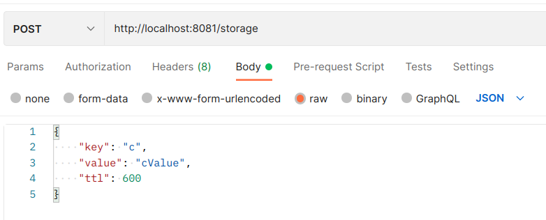
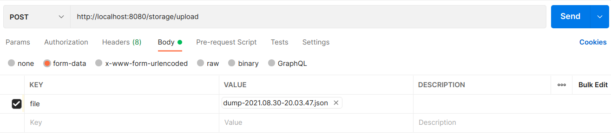

# Документация
Сервис-хранилище типа "ключ-значение". <br> 

Простой сервис который хранит данные в оперативной памяти по текстовому ключу.
### Разделы документации
1. Запуск сервиса
2. Операция чтения (get)
3. Операция записи (set)
4. Операция удаления (remove)
5. Операция сохранения текущего состояния (dump)
6. Операция загрузки состояния хранилища (load)

### 1. Запуск сервиса
Для запуска сервиса необходимо скачать данный [файл](target/ServiceStorage-0.0.1-SNAPSHOT.jar).<br>
Далее открыть в терминале (командной строке) папку с данным файлом
и выполнить следующую команду:
```console
java -jar ServiceStorage-0.0.1-SNAPSHOT.jar
```
По умолчанию сервис будет запущен на порту 8081, но вы можете выбрать
свой порт, если порт 8081 у вас занят, такой командой:
```console
java -Dserver.port=8888 -jar ServiceStorage-0.0.1-SNAPSHOT.jar
```

### 2. get
**Формат запроса (GET запрос):**
```console
http://localhost:8081/storage/{key}
```
**Описание:**
<br>

Возвращает данные, хранящиеся по ключу и статус 200 (ok) в случае
успешности операции.<br>

Если по данному ключу в хранилище нет данных, возвращается статус 404 (not found) и метка
"No data".

### 3. Операция записи (set)
**Формат запроса (POST запрос):**


**Описание:**
<br>

Принимает следующие параметры:
* ключ для хранилища
* данные для хранилища, которые будут ассоциированы с переданным ключом
* опциональный параметр ttl (продолжительность жизни записи в секундах), по истечении данного временного промежутка данная пара ключ-значение автоматически удаляется из хранилища

Если параметр не передан или данные параметра некорректны - используется ttl по-умолчанию (2100 секунд)
<br>

Если по переданному ключу уже хранятся данные - они заменяются новыми, а также обновляется ttl у данной записи в соответсвии с новыми данными.

Возвращает метку успешности ("Data added to storage" и статус 201 created) или список ошибок при чтении json и статус 400 bad request.
### 4. Операция удаления (remove)
**Формат запроса (DELETE запрос):**
```console
http://localhost:8081/storage/remove/{key}
```
**Описание:**
<br>

Удаляет данные, хранящиеся по переданному ключу.<br>
Возвращает данные, хранившиеся по переданному ключу и статус 200 ok.
<br>

Если по данному ключу в хранилище нет данных, возвращается статус 404 (not found) и метка
"No data".

### 5. Операция сохранения текущего состояния (dump)
**Формат запроса (GET запрос):**
```console
http://localhost:8081/storage/dump
```
**Описание:**
<br>

Сохраняет текущее состояние хранилища и возвращает его в виде загружаемого файла и статус 200 ok.
<br>

В параметре ttl сохраняется время, которое осталось до удаления на момент отправки запроса.

### 6. Операция загрузки состояния хранилища (load)
**Формат запроса (POST запрос):**



**Описание:**
<br>

Загружает состояние хранилища из файла, созданного операцией dump (пункт 5), и статус 201 created.
